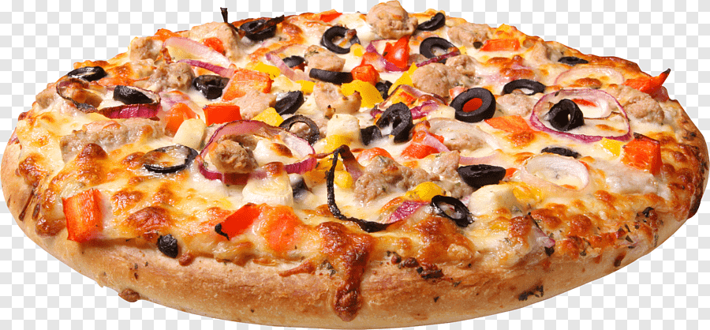

```{r setup, include=FALSE}
knitr::opts_chunk$set(echo = TRUE)
library(tidyverse) 
library(modelr)    
library(broom)     
library(ggpubr)
library(rstatix)
library(car)
library(broom)
library(dplyr)
library(tidyr)
library(haven)
library(readxl)
library(corrplot)
library(matlib)
library(ResourceSelection)
library(DescTools)
library(cvms)
library(ggplot2)
library(MASS)
library(broom)
library(tibble)
library(mlogit)
library("DescTools")
library(nnet)
library(dendextend) 
library(factoextra)
library(funModeling)
library(ISLR)
library(tidyverse)
library(readxl)
library(mice)
library(VIM)
library(ISLR)
library(Hmisc)
library(DMwR2)
library(rpart)
library(rpart.plot)
library(PerformanceAnalytics)
library(GGally)
library(ggpubr)
library(DescTools)
library(gplots)
library(funModeling)
library(rcompanion)
library(MASS)
library(TSstudio)
library(reshape2)
library(tsibble)
library(zoo)
library(xts)
library(forecast)
library(plotly)
pizza_marka <- read_excel("Pizza_data.xlsx")
```

# Veri Hakkında



Verimiz 300 gözlemden oluşan 10 farklı pizza markasındaki değerleriden oluşmaktadır.
Verimizin büyüklüğü çok yüksek olmadığından herhangi bir sampling işlemi yapılmamıştır.
Değişkenlerimizin açıklaması aşağıdaki gibidir.

brand: pizza markaları (A,B,C,D,E,F,G,H,I,J)
mois: örneklemdeki pizzanın 100 gramında bulunan su miktarı
prot: örneklemdeki pizzanın 100 gramında bulunan protein miktarı
ash: örneklemdeki pizzanın 100 gramında bulunan kül miktarı
sodium: örneklemdeki pizzanın 100 gramında bulunan sodyum miktarı
carb: örneklemdeki pizzanın 100 gramında bulunan karbonhidrat miktarı
cal: örneklemdeki pizzanın 100 gramında bulunan kalori miktarı
fat: örneklemdeki pizzanın 100 gramında bulunan yağ miktarı

NOT: Bütün analizlerde güven düzeyi %95 olarak alınmıştır.

## Veri Analizi

- Verimizin değişken özellikleri kontrol edilmiştir.

```{r}
str(pizza_marka)
```

```{r}
summary(pizza_marka)
```

- Verimizde eksik gözlem kontrolü yapılmıştır ve eksik gözlem olmadığı görülmüştür.

```{r}
anyNA(pizza_marka)
```


```{r}
plot2<-aggr(pizza_marka,col=c("navyblue","pink"),numbers=TRUE, sortVars=TRUE, labels=names(pizza_marka),cex.axis=.7,gap=3)
```

### Dendongram 

**"Euclidean"** methodu kullanılarak çizilen dendogram incelenmiştir ve 4 kümeye bölünmesi karar verilmiştir ve buna göre renklendirilmiştir.

```{r}
d <- dist(pizza_marka[,c(-1)], method = "euclidean") 
fit <- hclust(d, method="complete") 
dend<-as.dendrogram(fit)
plot(dend)
plot(color_branches(dend, k=4))
```

### Scree Plot

4. kırılım daha önceki kırılımlara aykırı olduğu için küme sayımızı 4 olarak karar verilmiştir.

```{r}
fviz_nbclust(pizza_marka[,c(-1)], kmeans, method = "wss")
```

```{r}
set.seed(95739487) 
km.res <- kmeans(pizza_marka[,c(-1)],4, iter.max=10, algorithm="Lloyd")
t(km.res$centers) 
```

### 2D Kümeleme Grafikleri

```{r}
library(cluster)
clusplot(pizza_marka[,c(-1)], km.res$cluster, main='2D representation of the Cluster solution',
         color=TRUE, shade=TRUE,
         labels=2, lines=0)
```

```{r}
fviz_cluster(km.res, data = pizza_marka[,c(-1)], palette = "jco",
             ggtheme = theme_minimal())
```

```{r}
pizza_marka$cluster<-km.res$cluster 
pizza_marka$cluster<-as.factor(pizza_marka$cluster)

```

### ANOVA TABLOLARI

cal, sodium, fat ve carb değişkenlerimizin kümeleme bağlı ANOVA tabloları çıkarılmıştır.

```{r}
library(rstatix)

cal_aov <- aov(cal ~ cluster, data = pizza_marka)
summary(cal_aov)
sodium_aov <- aov(sodium ~ cluster, data = pizza_marka)
summary(sodium_aov)
fat_aov <- aov(fat ~ cluster, data = pizza_marka)
summary(fat_aov)
carb_aov <- aov(carb ~ cluster, data = pizza_marka)
summary(carb_aov)
``` 

> Tüm ANOVA tablolarını incelediğimizde P-value değerleri 0.05' ten küçük olduğu için hepsi anlamlıdır ve kümelemlerin doğru yapıldığı söylenebilir.


# Kaynakça

> https://www.kaggle.com/shishir349/can-pizza-be-healthy

